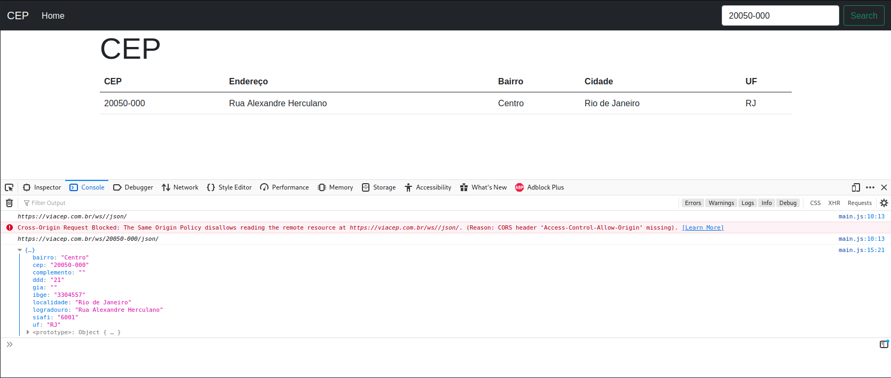

# JqueryAjax

<h4> TELA AJAX VIACEP </h4>

 Na tela faço uma requisicao usando ajax para a API do ViaCEP e pego o retorno especificando cada campo e coloco na td da tabela em tela. 

<ul>

<li> Visualizar o retorno da API do ViaCEP. </li>

</ul>

## 
